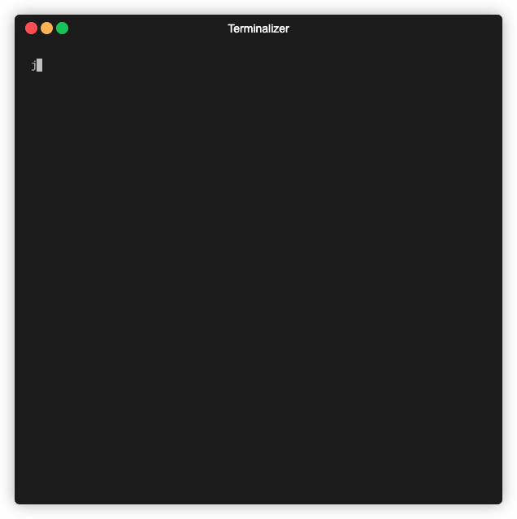

# jou

A beautiful, terminal-based journaling application built with Go and the Charmbracelet Bubble Tea framework. jou provides an intuitive command-line interface for creating, editing, and managing your daily journal entries.

 <!-- Placeholder for demo GIF -->

## Features

- **Create Journal Entries**: Write and save your daily thoughts and experiences
- **View Entries**: Browse through your journal entries with a clean, readable interface
- **Edit Entries**: Modify existing journal entries with ease
- **List Management**: View all your journal entries in an organized list
- **SQLite Storage**: All your entries are stored locally in a SQLite database
- **Beautiful UI**: Clean, modern terminal interface with intuitive navigation
- **Keyboard Shortcuts**: Efficient navigation with keyboard controls

## Quick Start

### Prerequisites

- Go 1.23.0 or later
- A terminal that supports ANSI escape codes

### Installation

#### From Source

```bash
# Clone the repository
git clone https://github.com/cheersmas/jou.git
cd jou

# Build the application
go build -o jou main.go

# Run the application
./jou
```

## Usage

### Navigation

- **Arrow Keys** or **j/k**: Navigate through menu options and journal entries
- **Enter**: Select an option or open a journal entry
- **Backspace**: Return to the main menu
- **Ctrl+C**: Exit the application

### Main Menu Options

1. **Add**: Create a new journal entry
2. **View**: Browse and read existing journal entries
3. **Edit**: Modify existing journal entries

### Writing Journal Entries

- Start typing in the text area to write your entry
- Use standard text editing shortcuts
- Save your entry using the appropriate keyboard shortcut
- Navigate back to the menu when finished

### Key Components

- **Bubble Tea Framework**: Powers the TUI (Terminal User Interface)
- **SQLite Database**: Stores journal entries locally
- **Clean Architecture**: Separation of concerns with ports and adapters
- **Repository Pattern**: Data access abstraction

## Development

### Setting Up Development Environment

```bash
# Clone the repository
git clone https://github.com/cheersmas/jou.git
cd jou

# Install dependencies
go mod download

# Run the application
go run main.go
```

### Building

```bash
# Build for current platform
go build -o jou main.go

# Build for multiple platforms
GOOS=linux GOARCH=amd64 go build -o jou-linux main.go
GOOS=windows GOARCH=amd64 go build -o jou-windows.exe main.go
GOOS=darwin GOARCH=amd64 go build -o jou-macos main.go
```

## Contributing

We welcome contributions! Please see our [Contributing Guidelines](CONTRIBUTING.md) for details.

### How to Contribute

1. Fork the repository
2. Create a feature branch (`git checkout -b feature/amazing-feature`)
3. Commit your changes (`git commit -m 'Add some amazing feature'`)
4. Push to the branch (`git push origin feature/amazing-feature`)
5. Open a Pull Request

### Development Guidelines

- Follow Go best practices and conventions
- Write tests for new features
- Update documentation as needed
- Ensure code is properly formatted with `gofmt`
- Use meaningful commit messages

## Known Issues

- [ ] Extra line on textarea
- [ ] Backspace removes characters on cancelling confirmation screen

## Roadmap

- [ ] Add search functionality for journal entries
- [ ] Implement journal entry categories/tags
- [ ] Add export functionality (JSON, Markdown)
- [ ] Implement journal entry templates
- [ ] Add dark/light theme support
- [ ] Implement journal entry encryption
- [ ] Add journal statistics and insights

## License

This project is licensed under the MIT License - see the [LICENSE](LICENSE) file for details.

## Acknowledgments

- [Charmbracelet](https://charm.sh/) for the amazing Bubble Tea framework
- [Lip Gloss](https://github.com/charmbracelet/lipgloss) for beautiful terminal styling
- The Go community for excellent tooling and libraries

## Support

If you encounter any issues or have questions:

1. Check the [Issues](https://github.com/cheersmas/jou/issues) page
2. Create a new issue if your problem isn't already reported.
3. Join our discussions for community support

---

**Happy Journaling!**
